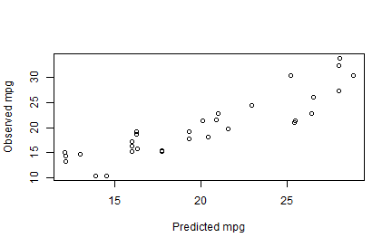

## What is this Shiny app?

This Shiny app (https://injemaster83.shinyapps.io/Assignment) helps to estimate the best linear model which predicts the miles per gallon in the Motor Trend Car Road Tests (mtcars dataset). 

--- .class #id 

## How does this app work?

In the left panel, there are 10 predictors you can choose to fit the model (Cylinders, Displacement, Gross horsepower, Rear axle ratio, Weight, Quarter-mile time, V/S and Transmission).  
After you choose, press the "Estimate model" button at the bottom of the left panel. You will see the following results:

1. Predicted versus observed values plot
2. Coefficients of the regression
3. Residual plots
4. R^2
5. Variance Inflation Factor (VIF)

--- .class #id

## How does this app work?

Example:


```r
data(mtcars)
fit <- lm(mpg ~ am + hp, mtcars)
plot(x=predict(fit,mtcars),y=mtcars$mpg,xlab="Predicted mpg",ylab="Observed mpg")
```

 

In the app, this piece of code is generated interactively by just selecting "am" and "hp" in the left panel.

--- .class #id

## Benefits

This simple but powerful app allows you to interactively select the best linear model for the mtcars dataset with **just few clicks**!  
You have all the relevant information in just one view, and any changes you make are updated instantly just pressing the "Estimate model" button.


